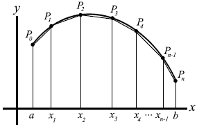

We want to approximate the length of a curve representing a function `y = f(x)` with `a <= x <= b`. First, we split the interval `[a, b]` into n sub-intervals with widths `h1, h2, ... , hn` by defining points `x1, x2 , ... , xn-1` between a and b. This defines points `P0, P1, P2, ... , Pn` on the curve whose x-coordinates are `a, x1, x2 , ... , xn-1, b` and y-coordinates `f(a), f(x1), ..., f(xn-1), f(b)` . By connecting these points, we obtain a polygonal path approximating the curve.

Our task is to approximate the length of a parabolic arc representing the curve `y = x * x` with `x` in the interval `[0, 1]`. We will take a common step h between the points `xi: h1, h2, ... , hn = h = 1/n` and we will consider the points `P0, P1, P2, ... , Pn` on the curve. The coordinates of each `Pi` are `(xi, yi = xi * xi)`.

The function `len_curve` (or similar in other languages) takes `n` as parameter (number of sub-intervals) and returns the length of the curve. You can truncate it to 9 decimal places.

